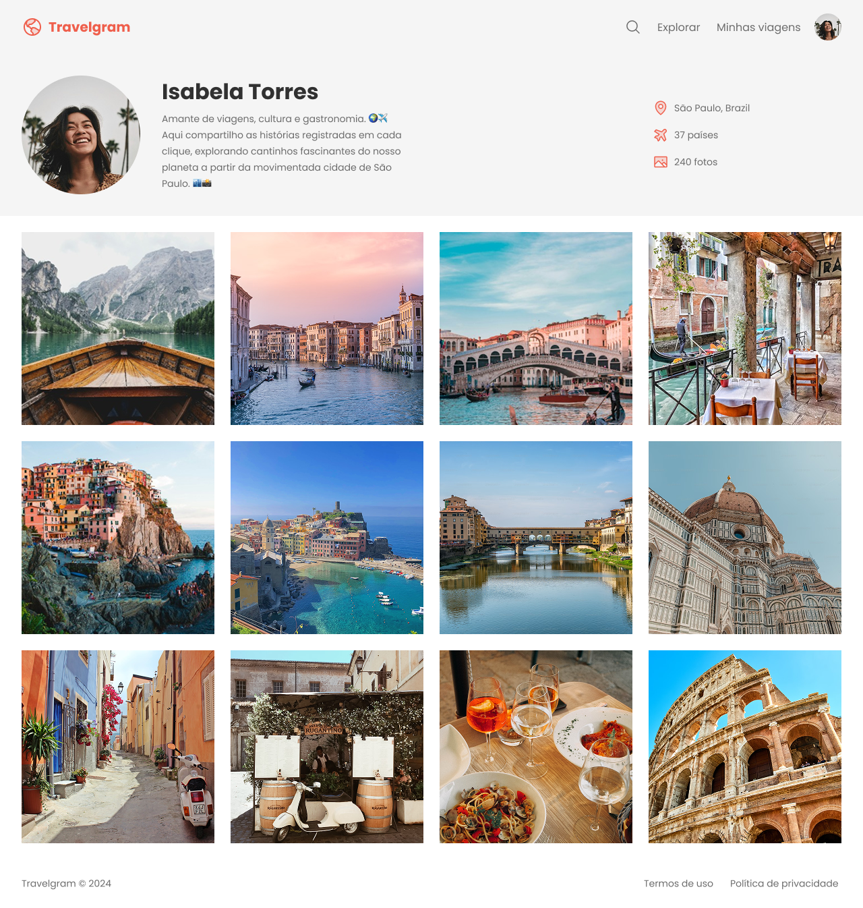

# ✈️ Travelgram – Perfil de Viagens

Este projeto é uma página web que simula o perfil de um usuário em uma rede social de viagens chamada **Travelgram**.
O layout é moderno e apresenta informações de perfil, estatísticas e uma galeria de fotos de viagens.

---

## 📂 Estrutura do Projeto

```
.
├── index.html        # Estrutura principal da página
├── styles/           # Pasta com os estilos CSS
│   ├── index.css     # Importa os demais arquivos de estilo
│   ├── global.css    # Estilos globais e variáveis
│   ├── nav.css       # Estilização do menu de navegação
│   ├── header.css    # Estilização do cabeçalho e perfil
│   ├── main.css      # Estilização da galeria principal
│   └── footer.css    # Estilização do rodapé
└── assets/           # Recursos visuais
    ├── Logo.svg
    ├── Profile.png
    ├── icons/        # Ícones usados no menu e informações
    │   ├── AirplaneTilt.svg
    │   ├── Image.svg
    │   ├── MagnifyingGlass.svg
    │   └── MapPin.svg
    └── images/       # Fotos de viagens
        ├── Image 01.png
        ├── Image 02.png
        └── ... até Image 12.png
```

---

## ✨ Funcionalidades

* 🧑‍💼 **Seção de perfil** com foto, nome e biografia.
* 📊 **Informações rápidas**: localização, países visitados e total de fotos.
* 🖼️ **Galeria de imagens** das viagens, organizada em grid flexível.
* 🧭 **Menu de navegação** com logo, busca, links e avatar do usuário.
* 🎨 **Design responsivo e moderno** com variáveis de cores e tipografia personalizada.

---

## 🖥️ Tecnologias Utilizadas

* **HTML5** – Estrutura semântica.
* **CSS3** – Layout com Flexbox, responsividade e variáveis CSS.
* **Google Fonts** – Fonte *Poppins*.

---

## 🚀 Como Executar

1. **Clonar o repositório**

   ```bash
   git clone https://github.com/joaovictorsalotialves/travelgram-perfil.git
   ```

2. **Acessar a pasta do projeto**

   ```bash
   cd travelgram-perfil
   ```

3. **Abrir no navegador**

   * Clique duas vezes no arquivo `index.html`
   * Ou use a extensão **Live Server** no VSCode para rodar localmente.

---

## 📸 Prévia do Projeto



---

## 📄 Licença

Este projeto foi desenvolvido para fins educacionais e pode ser utilizado livremente.
